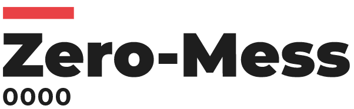

Hello Mess Pipeline
====================
[](https://www.nextflow.io/)

This pipeline demonstrates how to use the Zero-Mess library to send events to a
Kafka-compatible broker.

# Description
4 processes, each of them appends a line (in a different language) to a file consumed by the next process.
At the end of the execution, the content of the final file is shown.

## Messages
There are two types of messages:
* Stateful messages (<code>PipelineMessage</code>, <code>ProcessMessage</code>)
* Stateless messages (<code>BashMessage</code>)

Stateful messages are used inside the main pipeline code and benefit from the current state of the execution.

Stateless messages are executed locally or remotely inside a process execution. They don't have a state nor can access to the pipeline's state.
They need more parameters as they must be 'self-contained'.

### Pipeline Messages
Pipeline messages can be sent at any point in the pipeline code.

The following code shows how to build and send a message that notifies the pipeline has started:
```groovy
pipeline_topic_progress = pipeline_name + '.progress'

PipelineMessage.started().forTopic(pipeline_topic_progress)
        .data('launch time', "${workflow.start.format('dd-MMM-yyyy HH:mm:ss')}")
        .data('hope', 'wish it works').send()
```

or
```groovy
PipelineMessage.started(workflow).forTopic(pipeline_topic_progress)
        .data('hope', 'wish it works').send()
```

### Process Messages

A process can log started and completed events using <code>ProcessMessage</code> inside the
<code>beforeScript</code> and <code>afterScript</code> directives.

These two directives allow to specify one or more commands to execute in a shell before and after the process execution.
For this reason, the <code>buildCommand()</code> should be invoked instead of <code>send()</code>
```groovy
process A {
    // Messaging
    beforeScript ProcessMessage.started('A').forTopic('A.progress').buildCommand()
    
    afterScript ProcessMessage.completed('A').forTopic('A.completed').buildCommand()

    input:
    
    output:
    
    """
    """
}
```
### Bash messages
If the process' script is a Bash script, the <code>BashMessage</code> function can be used at any point in the script.

The expected parameters are:
* the topic where to publish the message
* the data for the payload. Format: <pre>"name1":"value1","name2":"value2","name3":"value3"</pre> surrounded by single quotes.
For example:
```bash
BashMessage 'A.progress' '"processName":"A","status":"about to echo to helloA.txt"'
echo 'Hello from A' > helloA.txt
if [[ $? != 0 ]]; then
    BashMessage 'A.failure' '"processName":"A","exitStatus":"127","message":"A failed to echo"'
    exit 127
fi
```

# Execution
Clone the project and run:

    nextflow run main.nf  

or with [pipeline sharing](https://www.nextflow.io/docs/latest/en/latest/sharing.html), just run:

    nextflow run eipm/hello-mess-nf
